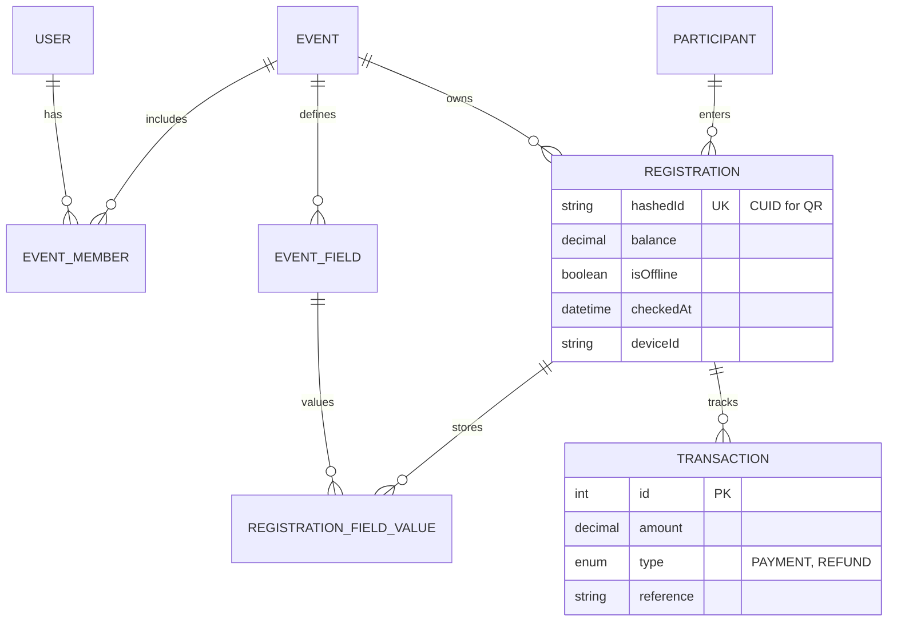

# 🛠️ Technical Specifications: Konevx 2.0

**Project:** Konevx (API-First Architecture)
**Lead Architect:** Azul-Arch
**Database:** PostgreSQL (Optimized via Prisma Logic)
**Backend:** Laravel 11 / PHP 8.3
**Protocol:** PEI-Standard

---

## 1. Data Model Strategy (Enhanced Prisma Schema)

Adoptamos la estructura dinámica del `schema.prisma` pero con inyecciones de rendimiento para Laravel Eloquent.

### Modelos Clave y Mejoras

1. **Event & EventField:** Implementan el patrón EAV (Entity-Attribute-Value) para flexibilidad total en los formularios.
2. **Registration:** Se añade `hashedId` (Unique Index) para el escaneo de QR y `balance` (Decimal) para finanzas.
3. **Transaction:** (Nuevo) Tabla para el historial de pagos (Type: PAYMENT, REFUND, DISCOUNT).
4. **Offline Audit:** Campos `isOffline`, `deviceId` y `checkedAt` para la trazabilidad de entradas.

---

## 2. ERD (Entity Relationship Diagram)

---

## 3. High Performance & Real-time (< 200ms)

Para garantizar la velocidad en la entrada del evento:

- **Redis Layer:** Cacheo del objeto `Registration` completo indexado por `hashedId`.
- **Database Indexing:**
  - `CREATE INDEX idx_registration_hashedid ON registrations(hashed_id);`
  - `CREATE INDEX idx_participant_normalized ON participants(email_normalized, phone_normalized);`
- **Fuzzy Search:** Uso de búsqueda por similitud en PostgreSQL/MySQL para encontrar nombres con errores tipográficos rápido.

---

## 4. API & Integration

- **Auth:** JWT / PASETO mediante la tabla `Session` vinculada al `User`.
- **Sync Endpoint:** `POST /api/v1/sync/checkins` aceptando un array de objetos offline con timestamp original.
- **Azul-Guard:** Middleware global que inyecta la cabecera `X-PEI-Latency` en cada respuesta.

---

## 5. Mobile/Tablet Implementation (Flutter)

- **Local DB:** SQLite replicando la tabla `Registration` (solo campos `hashedId`, `name`, `status`).
- **QR Logic:** La App desencripta el hash, valida localmente y encola la petición de sincronización.

---

## 5. Mobile/Tablet Implementation (Flutter)

- **Local DB:** SQLite replicando la tabla `Registration` (solo campos `hashedId`, `name`, `status`).
- **QR Logic:** La App desencripta el hash, valida localmente y encola la petición de sincronización.
